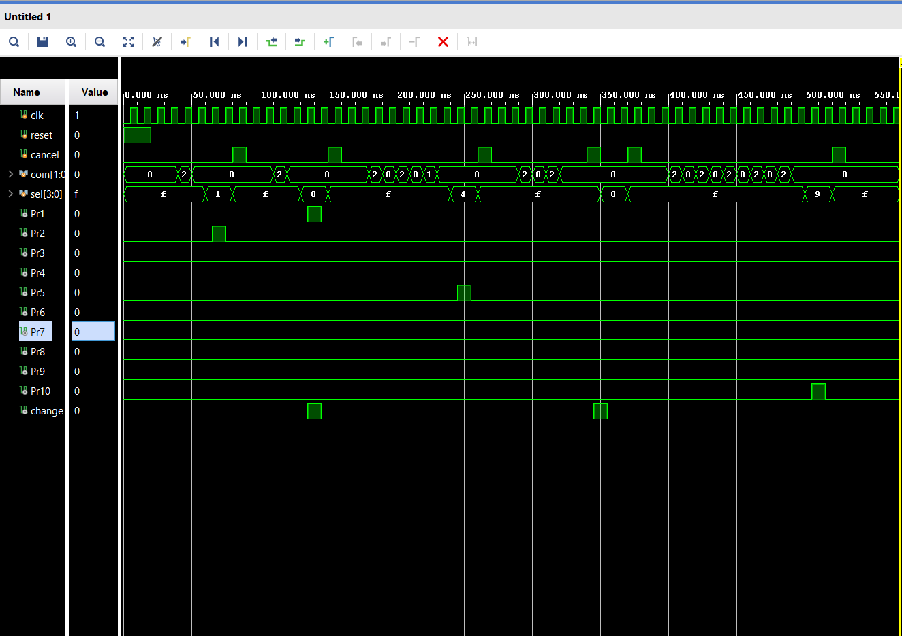

# Vending_Machine
The objective of this project is to develop a Verilog-based Finite State Machine (FSM) for a Vending Machine that accepts specific coin denominations, dispenses a product upon reaching a target price, and accurately calculates/returns change when necessary.

## Project Overview
This project focuses on developing a control system for a vending machine with a fixed product price.

### Vending Machine System Specifications
* **Coin Inputs:** Accepts 5 Rs and 10 Rs coins.
* **Product Selection:** Supports 10 distinct products (`Pr1` to `Pr10`).
* **Price Range:** Products are priced in increments of 5, from 5 Rs (Pr1) to 50 Rs (Pr10).
* **Features:**
    * **Accumulation:** Tracks total money inserted up to 50 Rs.
    * **Change Return:** Signals if excess money was inserted.
    * **Cancellation:** Allows the user to abort the process and retrieve their money.

### Functionality
1.  **Idle State (S0):** The machine waits for a coin.
2.  **Money Insertion:** As coins (5 Rs or 10 Rs) are added, the state transitions upward (e.g., S0 -> S5 -> S15).
3.  **Selection (`sel`):** The user selects a product via a 4-bit input.
4.  **Comparison:**
    * If **Money == Price**: Dispense Product, Return 0 Change, Reset to S0.
    * If **Money > Price**: Dispense Product, Signal Change, Reset to S0.
    * If **Money < Price**: Remain in current state (wait for more coins).
5.  **Cancel:** If the cancel button is pressed, the machine resets to S0 and asserts the change signal to return the full amount.

## Explanation

### Inputs and Outputs

| Signal | Direction | Width | Description |
| :--- | :--- | :--- | :--- |
| `clk` | Input | 1-bit | System Clock |
| `reset` | Input | 1-bit | System Reset (Active High) |
| `cancel` | Input | 1-bit | Cancels transaction, returns money |
| `coin` | Input | 2-bit | `01` = 5 Rs, `10` = 10 Rs |
| `sel` | Input | 4-bit | Selects Product (`0000`=Pr1 ... `1001`=Pr10) |
| `Pr1`...`Pr10` | Output | 1-bit | Dispense signal for specific product |
| `change` | Output | 1-bit | High if change/refund is returned |

### State Mapping
The FSM uses states to represent the current accumulated balance.
* **S0:** 0 Rs
* **S5:** 5 Rs
* **S10:** 10 Rs
* ...
* **S50:** 50 Rs

### Logic Example
**Scenario: Buying Pr3 (Cost 15 Rs)**
1.  User inserts 5 Rs -> State moves S0 to S5.
2.  User inserts 10 Rs -> State moves S5 to S15.
3.  User sets `sel` to `0010` (Pr3).
4.  Logic checks S15: Is `sel <= 0010`? Yes.
5.  **Next State:** S0.
6.  **Output:** `Pr3` goes High. `change` stays Low (Exact change).

## RTL Code

```verilog
`timescale 1ns / 1ps

module VendingMachine(
    input clk, reset, cancel,
    input [1:0] coin, // 01=5rs , 10=10rs
    input [3:0] sel,
    output reg Pr1, Pr2, Pr3, Pr4, Pr5, Pr6, Pr7, Pr8, Pr9, Pr10, change
    );

    parameter S0=4'b0000, S5=4'b0001, S10=4'b0010, S15=4'b0011, S20=4'b0100, 
              S25=4'b0101, S30=4'b0110, S35=4'b0111, S40=4'b1000, S45=4'b1001, S50=4'b1010;
 
    reg [3:0] current_state, next_state;
 
    // State Transition Block
    always@(posedge clk or posedge reset) begin
        if(reset) 
            current_state <= S0;
        else 
            current_state <= next_state;
    end
 
    // Next State Logic
    always @(*) begin
        case(current_state)
            S0: begin
                if(coin==2'b01) next_state=S5;
                else if(coin==2'b10) next_state=S10;
                else next_state = S0;
            end

            S5: begin 
                if (sel==4'b0000) next_state = S0; // Buy 5rs -> Reset to 0
                else if(coin==2'b01) next_state=S10;
                else if(coin==2'b10) next_state=S15;
                else if (cancel) next_state = S0;
                else next_state = S5;
            end

            S10: begin 
                if (sel==4'b0000 || sel==4'b0001) next_state = S0; 
                else if(coin==2'b01) next_state=S15;
                else if(coin==2'b10) next_state=S20;
                else if (cancel) next_state = S0;
                else next_state = S10;
            end

            // ... (States S15 to S45 follow similar pattern) ...
            
            S15: begin 
                if (sel <= 4'b0010) next_state = S0; 
                else if(coin==2'b01) next_state=S20;
                else if(coin==2'b10) next_state=S25;
                else if (cancel) next_state = S0;
                else next_state = S15;
            end 

            S20: begin 
                if (sel <= 4'b0011) next_state = S0;
                else if(coin==2'b01) next_state=S25;
                else if(coin==2'b10) next_state=S30;
                else if (cancel) next_state = S0;
                else next_state = S20;
            end 

            S25: begin 
                if (sel <= 4'b0100) next_state = S0;
                else if(coin==2'b01) next_state=S30;
                else if(coin==2'b10) next_state=S35;
                else if (cancel) next_state = S0;
                else next_state = S25;
            end

            S30: begin 
                if (sel <= 4'b0101) next_state = S0;
                else if(coin==2'b01) next_state=S35;
                else if(coin==2'b10) next_state=S40;
                else if (cancel) next_state = S0;
                else next_state = S30;
            end  

            S35: begin 
                if (sel <= 4'b0110) next_state = S0;
                else if(coin==2'b01) next_state=S40;
                else if(coin==2'b10) next_state=S45;
                else if (cancel) next_state = S0;
                else next_state = S35;
            end 

            S40: begin 
                if (sel <= 4'b0111) next_state = S0;
                else if(coin==2'b01) next_state=S45;
                else if(coin==2'b10) next_state=S50;
                else if (cancel) next_state = S0;
                else next_state = S40;
            end 

            S45: begin 
                if (sel <= 4'b1000) next_state = S0;
                else if(coin==2'b01) next_state=S50;
                else if (cancel) next_state = S0;
                else next_state = S45;
            end

            S50: begin 
                if (sel <= 4'b1001) next_state = S0;
                else if (cancel) next_state = S0;
                else next_state = S50;
            end 

            default next_state=S0;
        endcase
    end
 
    // Output Logic Block
    always@(posedge clk or posedge reset) begin
        if (reset) begin
            Pr1<=0; Pr2<=0; Pr3<=0; Pr4<=0; Pr5<=0; 
            Pr6<=0; Pr7<=0; Pr8<=0; Pr9<=0; Pr10<=0; change<=0;
        end 
        else begin
            // Default Low
            Pr1<=0; Pr2<=0; Pr3<=0; Pr4<=0; Pr5<=0; 
            Pr6<=0; Pr7<=0; Pr8<=0; Pr9<=0; Pr10<=0; change<=0;

            case(current_state) 
                S5 : begin
                    if (sel==4'b0000) begin Pr1<=1; change <= 0; end
                end

                S10 : begin
                    if (sel==4'b0000) begin Pr1<=1; change <= 1; end
                    else if (sel==4'b0001) begin Pr2<=1; change <= 0; end
                end

                S15 : begin
                    if (sel==4'b0000) begin Pr1<=1; change <= 1; end
                    else if (sel==4'b0001) begin Pr2<=1; change <= 1; end
                    else if (sel==4'b0010) begin Pr3<=1; change <= 0; end
                end

                S20 : begin
                    if (sel==4'b0000) begin Pr1<=1; change <= 1; end
                    else if (sel==4'b0001) begin Pr2<=1; change <= 1; end
                    else if (sel==4'b0010) begin Pr3<=1; change <= 1; end
                    else if(sel==4'b0011) begin Pr4<=1; change <= 0; end
                end

                S25 : begin
                    if (sel==4'b0000) begin Pr1<=1; change <= 1; end
                    else if (sel==4'b0001) begin Pr2<=1; change <= 1; end
                    else if (sel==4'b0010) begin Pr3<=1; change <= 1; end
                    else if (sel==4'b0011) begin Pr4<=1; change <= 1; end
                    else if (sel==4'b0100) begin Pr5<=1; change <= 0; end
                end

                S30 : begin
                    if (sel==4'b0000) begin Pr1<=1; change <= 1; end
                    else if (sel==4'b0001) begin Pr2<=1; change <= 1; end
                    else if (sel==4'b0010) begin Pr3<=1; change <= 1; end
                    else if (sel==4'b0011) begin Pr4<=1; change <= 1; end
                    else if (sel==4'b0100) begin Pr5<=1; change <= 1; end
                    else if (sel==4'b0101) begin Pr6<=1; change <= 0; end
                end

                S35 : begin
                    if (sel==4'b0000) begin Pr1<=1; change <= 1; end
                    else if (sel==4'b0001) begin Pr2<=1; change <= 1; end
                    else if (sel==4'b0010) begin Pr3<=1; change <= 1; end
                    else if (sel==4'b0011) begin Pr4<=1; change <= 1; end
                    else if (sel==4'b0100) begin Pr5<=1; change <= 1; end
                    else if (sel==4'b0101) begin Pr6<=1; change <= 1; end
                    else if (sel==4'b0110) begin Pr7<=1; change <= 0; end
                end

                S40 : begin
                    if (sel==4'b0000) begin Pr1<=1; change <= 1; end
                    else if (sel==4'b0001) begin Pr2<=1; change <= 1; end
                    else if (sel==4'b0010) begin Pr3<=1; change <= 1; end
                    else if (sel==4'b0011) begin Pr4<=1; change <= 1; end
                    else if (sel==4'b0100) begin Pr5<=1; change <= 1; end
                    else if (sel==4'b0101) begin Pr6<=1; change <= 1; end
                    else if (sel==4'b0110) begin Pr7<=1; change <= 1; end
                    else if (sel==4'b0111) begin Pr8<=1; change <= 0; end
                end

                S45 : begin
                    if (sel==4'b0000) begin Pr1<=1; change <= 1; end
                    else if (sel==4'b0001) begin Pr2<=1; change <= 1; end
                    else if (sel==4'b0010) begin Pr3<=1; change <= 1; end
                    else if (sel==4'b0011) begin Pr4<=1; change <= 1; end
                    else if (sel==4'b0100) begin Pr5<=1; change <= 1; end
                    else if (sel==4'b0101) begin Pr6<=1; change <= 1; end
                    else if (sel==4'b0110) begin Pr7<=1; change <= 1; end
                    else if (sel==4'b0111) begin Pr8<=1; change <= 1; end
                    else if (sel==4'b1000) begin Pr9<=1; change <= 0; end
                end

                S50 : begin
                    if (sel==4'b0000) begin Pr1<=1; change <= 1; end
                    else if (sel==4'b0001) begin Pr2<=1; change <= 1; end
                    else if (sel==4'b0010) begin Pr3<=1; change <= 1; end
                    else if (sel==4'b0011) begin Pr4<=1; change <= 1; end
                    else if (sel==4'b0100) begin Pr5<=1; change <= 1; end
                    else if (sel==4'b0101) begin Pr6<=1; change <= 1; end
                    else if (sel==4'b0110) begin Pr7<=1; change <= 1; end
                    else if (sel==4'b0111) begin Pr8<=1; change <= 1; end
                    else if (sel==4'b1000) begin Pr9<=1; change <= 1; end
                    else if (sel==4'b1001) begin Pr10<=1; change <= 0; end
                end
            endcase

            // Cancel Logic
            if(cancel) begin
                if(current_state != S0) 
                    change <= 1; // Return Money
                else 
                    change <= 0;
            end
        end
    end
endmodule

```

## Schematic


## Testbench
```verilog
`timescale 1ns / 1ps

module VendingMachine_tb;

    // Inputs
    reg clk;
    reg reset;
    reg cancel;
    reg [1:0] coin;
    reg [3:0] sel;

    // Outputs
    wire Pr1, Pr2, Pr3, Pr4, Pr5, Pr6, Pr7, Pr8, Pr9, Pr10;
    wire change;

    // Instantiate the Vending Machine
    VendingMachine uut (
        .clk(clk), 
        .reset(reset), 
        .cancel(cancel), 
        .coin(coin), 
        .sel(sel), 
        .Pr1(Pr1), .Pr2(Pr2), .Pr3(Pr3), .Pr4(Pr4), .Pr5(Pr5), 
        .Pr6(Pr6), .Pr7(Pr7), .Pr8(Pr8), .Pr9(Pr9), .Pr10(Pr10), 
        .change(change)
    );

    // Clock Generation (Period = 10ns)
    always #5 clk = ~clk;

    // Helper task to insert a coin for exactly 1 cycle
    task insert_coin;
        input [1:0] c;
        begin
            @(negedge clk) coin = c;
            @(negedge clk) coin = 0;
            #10; // Wait a bit for state transition
        end
    endtask

    // Helper task to reset the machine between tests
    task reset_machine;
        begin
            sel = 4'b1111; // Deselect everything
            cancel = 1; 
            #10; 
            cancel = 0; 
            #20;
        end
    endtask

    initial begin
        // Initialize
        clk = 0;
        reset = 1;
        cancel = 0;
        coin = 0;
        sel = 4'b1111;

        // Global Reset
        #20 reset = 0;
        #20;

        // -------------------------------------------------------------
        // TEST CASE 1: Exact Change (Simple)
        // Goal: Buy Product 2 (10rs) using a 10rs coin.
        // -------------------------------------------------------------
        $display("--- Test Case 1: Exact Change (10rs for Pr2) ---");
        insert_coin(2'b10); // Insert 10rs
        
        // Machine is in S10
        sel = 4'b0001; // Select Pr2
        #20;
        
        // Verify: Pr2 should be 1, Change should be 0
        reset_machine(); // Clear for next test


        // -------------------------------------------------------------
        // TEST CASE 2: Returning Change
        // Goal: Buy Product 1 (5rs) using a 10rs coin.
        // -------------------------------------------------------------
        $display("--- Test Case 2: Returning Change (10rs for Pr1) ---");
        insert_coin(2'b10); // Insert 10rs
        
        // Machine is in S10
        sel = 4'b0000; // Select Pr1 (Cost 5rs)
        #20;

        // Verify: Pr1 should be 1, Change should be 1
        reset_machine();


        // -------------------------------------------------------------
        // TEST CASE 3: Accumulating Money
        // Goal: Buy Product 5 (25rs) by inserting 10 + 10 + 5.
        // -------------------------------------------------------------
        $display("--- Test Case 3: Accumulation (10+10+5 = 25rs for Pr5) ---");
        insert_coin(2'b10); // 10rs (Total: 10)
        insert_coin(2'b10); // 10rs (Total: 20)
        insert_coin(2'b01); // 5rs  (Total: 25)

        // Machine is in S25
        sel = 4'b0100; // Select Pr5
        #20;

        // Verify: Pr5 should be 1, Change should be 0
        reset_machine();


        // -------------------------------------------------------------
        // TEST CASE 4: Cancel / Refund
        // Goal: Insert money, change mind, press cancel, verify reset.
        // -------------------------------------------------------------
        $display("--- Test Case 4: Cancel Functionality ---");
        insert_coin(2'b10); // Insert 10rs
        insert_coin(2'b10); // Insert 10rs (Total: 20)
        
        #10;
        cancel = 1; // User presses cancel
        #10;
        cancel = 0;
        
        // Try to buy something now (should fail)
        sel = 4'b0000; // Try to buy Pr1 (5rs)
        #20;
        
        // Verify: Pr1 should remain 0 because state reset to S0
        reset_machine();


        // -------------------------------------------------------------
        // TEST CASE 5: Max State / High Cost
        // Goal: Reach S50 and buy Product 10 (50rs).
        // -------------------------------------------------------------
        $display("--- Test Case 5: Max State S50 (5x 10rs for Pr10) ---");
        insert_coin(2'b10); // 10
        insert_coin(2'b10); // 20
        insert_coin(2'b10); // 30
        insert_coin(2'b10); // 40
        insert_coin(2'b10); // 50

        // Machine is in S50
        sel = 4'b1001; // Select Pr10
        #20;
        
        // Verify: Pr10 should be 1, Change should be 0
        reset_machine();

        $display("--- All Tests Completed ---");
        #20 $finish;
    end
    
    // Monitor for debugging
    initial begin
         $monitor("Time=%0t | State=%d | Coin=%b | Sel=%h | Cancel=%b | Change=%b | Pr1=%b Pr2=%b Pr5=%b Pr10=%b", 
                  $time, uut.current_state, coin, sel, cancel, change, Pr1, Pr2, Pr5, Pr10);
    end

endmodule
```
## Waveform



### Waveform Analysis

The waveform highlights five distinct scenarios executed during the testbench simulation:

1. **System Reset (0 - 20 ns):**
   * The `reset` signal is asserted (High), initializing the system state to `S0` and ensuring all outputs (`Pr` signals and `change`) are Low.

2. **Scenario 1: Exact Payment (Approx. 50 ns)**
   * **Action:** A 10 Rs coin (`coin = 2`) is inserted.
   * **Selection:** The user selects **Product 2** (`sel = 1`), which costs 10 Rs.
   * **Result:** The machine detects an exact match. The signal `Pr2` goes High to dispense the product. `change` remains Low.

3. **Scenario 2: Overpayment & Change (Approx. 120 ns)**
   * **Action:** A 10 Rs coin (`coin = 2`) is inserted.
   * **Selection:** The user selects **Product 1** (`sel = 0`), which costs 5 Rs.
   * **Result:** Since 10 Rs > 5 Rs, the machine dispenses the product (`Pr1` goes High) and simultaneously asserts the `change` signal (High) to return the excess 5 Rs.

4. **Scenario 3: Accumulation of Credits (Approx. 200 ns)**
   * **Action:** The user inserts multiple coins sequentially: 10 Rs, 10 Rs, and 5 Rs (Total = 25 Rs).
   * **Selection:** The user selects **Product 5** (`sel = 4`), which costs 25 Rs.
   * **Result:** The FSM successfully accumulates the value across states (`S10` -> `S20` -> `S25`). Once the total reaches 25 Rs, `Pr5` goes High to dispense the product.

5. **Scenario 4: Transaction Cancellation (Approx. 300 ns)**
   * **Action:** Coins are inserted, but the user decides not to buy.
   * **Input:** The `cancel` signal is pulsed High.
   * **Result:** The machine immediately resets to state `S0` and asserts the `change` signal to refund the full inserted amount.

6. **Scenario 5: High-Value Transaction (End of Simulation)**
   * **Action:** Sufficient coins are inserted to reach 50 Rs.
   * **Selection:** **Product 10** (`sel = 9`) is selected.
   * **Result:** `Pr10` goes High, verifying that the machine handles the maximum state limit correctly.
  
## Result

The design of the Multi-Product Vending Machine was successfully implemented and verified using Verilog HDL. The simulation results confirm that the Finite State Machine (FSM) correctly handles sequential inputs of 5 Rs and 10 Rs coins, accurately transitioning between states to track accumulated credit up to 50 Rs.

**Key Achievements:**
1.  **Accurate State Tracking:** The FSM transitions verified that the machine correctly calculates the total value of inserted coins without error.
2.  **Multi-Product Logic:** The system successfully differentiated between 10 unique product selections, dispensing the correct item only when sufficient funds were available.
3.  **Refund & Cancellation:** The logic for returning change (in cases of overpayment) and refunding money (upon cancellation) functioned correctly, ensuring no monetary loss for the user.

In conclusion, this project demonstrates the efficiency of Verilog HDL in designing reliable control systems for automated retail applications. The use of a modular FSM architecture ensures that the design is scalable and prevents undefined states during operation.


